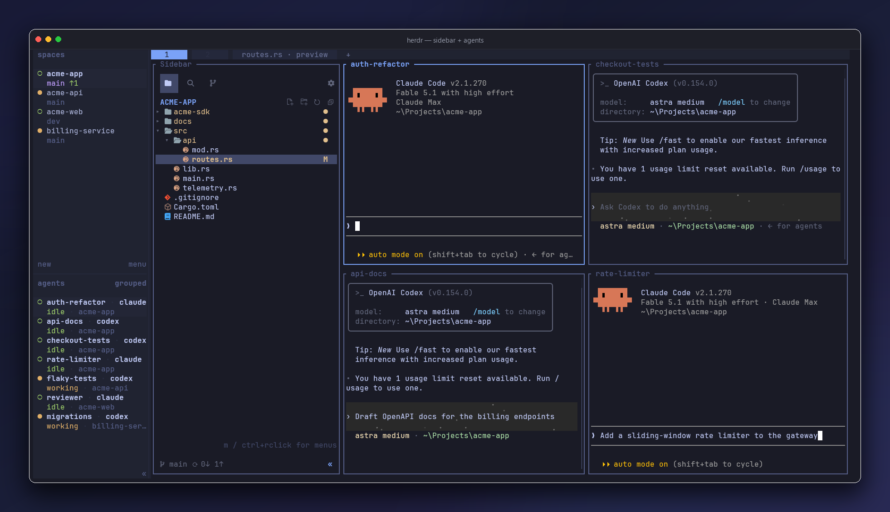

# herdr-sidebar

**The sidebar your terminal was missing** — a VS Code-inspired file explorer + source
control panel in one dockable herdr pane.



**The full tour lives in the [upstream README](https://github.com/alexarthurs/herdr-sidebar#readme)** — features, screenshots,
keys, and settings.

Quick Open is `Ctrl+P`; project text search has its own activity view and opens with `Ctrl+F`
or `Ctrl+Shift+F`. It searches live with match-case, whole-word, regex, and include/exclude filters.
Herdr keybindings can invoke `show-explorer`, `show-search`, `show-git`, or `quick-open`
directly (`-windows` suffix on Windows), so chords such as `Cmd+P` are remappable by the host.
The Git footer keeps branch switching and sync one click away in every view and can be hidden
from Settings.

When a `.code-workspace` is selected, Source Control keeps **Changes** as the actionable
default and adds a read-only **Δ Workspace** tab (`D` from Explorer or Source Control).
It lists only folders in that workspace, grouped by their `task.json` registration; the
task header shows selected/declared repositories. Each row separates committed changes
(`C`) since the merge-base with the repository registry's `default_branch` from staged
(`S`), unstaged (`W`), and untracked (`U`) files. Enter expands a repository or previews
a file; `c` switches to actionable Changes. The baseline uses locally cached
remote-tracking refs: no fetch occurs, so it may be stale. Missing or mismatched refs
appear as `C?` with a reason on expansion, never as zero changes. Press `r` to reread
workspace selection and local refs. If discovery is ambiguous, set
`HERDR_SIDEBAR_CODE_WORKSPACE` to the desired `.code-workspace` path.

Common image formats render directly in the preview pane; videos show a poster frame when
`ffmpeg` is available on `PATH`.
To open clicked files in a terminal editor, configure "Custom editor…" in sidebar Settings, then
enable "Use editor on click". Clicking an already-open file focuses its existing editor tab;
keyboard Enter continues to use the built-in preview.

## Install

Requires herdr 0.8 or newer. Source builds require Rust 1.89 or newer.

```
herdr plugin install alexarthurs/herdr-sidebar/plugins/herdr-sidebar
```

or from a local checkout:

```
cargo build --release
herdr plugin link .
```

Open it (or just focus a tab — the hook docks it):

```
herdr plugin action invoke herdr-sidebar.open-sidebar-windows   # windows
herdr plugin action invoke herdr-sidebar.open-sidebar           # linux / macos
```
